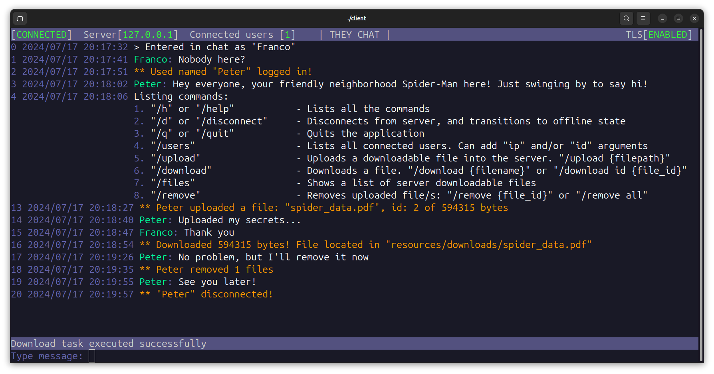

# They Chat

## Overview

TheyChat is a client-server chat application developed solely by me. The application allows multiple clients to connect to a server,exchange messages and files. The project is built using CMake and is designed to run on POSIX systems, utilizing pthreads for multithreading and ncurses for a simple client UI. Communication between the client and server is encrypted using OpenSSL.




## Features

- **Multithreaded Server**: Handles multiple clients concurrently using pthreads.
- **Client UI**: Simple text-based interface built with ncurses.
- **Encrypted Communication**: Ensures secure message transfer using SSL.
- **File transferring**: Clients can upload and download files.
- **Commands**: Clients can send messages and execute commands.
- **Cross-platform**: Designed to run on POSIX-compliant systems.
- **CMake Build System**: Easy to build and manage the project.
- **MIT Licensed**: Open-source and freely available for modification and distribution.

### Networking Implementation

All the networking functionality in this project has been implemented from scratch using raw sockets. This means that no additional libraries or frameworks were used to handle network communication. The code directly interacts with the underlying operating system's networking stack to manage connections, data transfer, and other network-related tasks. This approach ensures a deeper understanding and control over the networking processes, making the implementation more robust and customizable.

#### Learning Objective

The primary goal of this project is to facilitate learning and to gain a comprehensive understanding of network programming at a low level. By building the networking stack from the ground up, this project provides invaluable insights into the intricacies of network communication, socket programming, and error handling.

## Getting Started

### Prerequisites

- **POSIX-compliant system** (Linux, macOS, etc.)
- **C 17** compatible compiler
- **CMake**
- **OpenSSL** (library `libssl-dev` installed)
- **ncurses** (`ncurses` installed)

### Building the Project
The following process builds server and client:
1. Clone the repository:
    ```sh
    git clone --recursive https://github.com/FrancoYudica/TheyChat.git
    cd TheyChat
    ```

2. Create a build directory and navigate into it:
    ```sh
    mkdir build
    cd build
    ```

3. Run CMake to configure the project:
    ```sh
    cmake ..
    ```

    **Build Options:**
    - `THEY_CHAT_SSL`: Enable or disable SSL encryption.
      ```sh
      cmake -DTHEY_CHAT_SSL=ON ..
      ```         
        If `THEY_CHAT_SSL` is enabled and you want to run the sever, a certificate and key file should be provided. By default, the application expects the certificate and key to be located in `~/.ssl/TheyChat/` directory with filenames `certificate.pem` and `private.key` respectively.

        To generate the certificate and key, you can use the `generate_ssl.sh` script. This script creates the necessary files in the `~/.ssl/TheyChat/` directory. The generated certificate is a self-signed certificate, created for testing purposes.

        ```sh
        chmod +x generate_ssl.sh
        ./generate_ssl.sh
        ```
    - `THEY_CHAT_COMPILE_TESTS`: Enable or disable tests.
      ```sh
      cmake -DTHEY_CHAT_COMPILE_TESTS=ON ..
      ```

4. Build the project:
    ```sh
    make
    ```
   

### Precompiled binaries
This project provides precompiled binaries for various platforms to facilitate easy installation and usage. Below are the available binaries along with their dynamic linking requirements

#### Linux x86_64
[Linux x86_64](https://github.com/FrancoYudica/TheyChat/tree/main/releases) binaries requires `libncurses` and `libssl` libraries. 
> [!WARNING]
> Ensure these libraries are installed on your system, and the resources folder is downloaded as well.
> These binaries are tested in Ubuntu, but should work in Debian, Fedora, CentOS, Arch and more.

### Running programs
For **server** navigate to the build/server directory and run executable: ```./server```

For **client** navigate to the build/client directory and run executable: ```./client```

> [!TIP]  
> Note that both programs accept arguments, such as status port, task port and more.

## Usage

### Server
Once the program is executed, it listens for incoming client connections, handling different states such as *login*, *chat*, *disconnect* and more.
The only accepted inputs are signals that terminate the program, such as ctrl+c or closing the terminal. Note that if the server is exited with one of the accepted signals, it closes all the connections and cleanly frees all memory.

### Client
Client is a command based program, meaning that all the interactions are executed with defined commands. 
> [!TIP]  
> If you want to check the available commands, execute `/h`. Keep in mind that the available commands change in different states of the program. 

It starts in the **offline state**, and the connection with the server should be established with the `/connect` command, where the server IP is expected as argument. Once connected to the server, the program enters **login state**, asks for a unique username, and then enters the **chat state**. Once you are done using client program you can use `/quit` or `/disconnect` in case you want to got to the **offline state**.

#### Commands
- ```/help```: Lists all the available commands in the current program state.
- ```/connect```: Establishes connection with server.
- ```/disconnect```: Disconnects from server, and transitions to offline state
- ```/quit```: Quits the application
- ```/users```: Lists all connected users, and allows arguments such as *ip* to see the ip of users.
- ```/files```: Lists downloadable files with it's name, id and owner.
- ```/upload```: Uploads a file to the server
- ```/download```: Downloads a file from the server
- ```/remove```: Removes uploaded file/s. You can specify individual files id or use argument *all* to remove all

## File transferring
Since TheyChat uses a client-server architecture, clients should first upload files to the server. When any client uploads a file, all the other clients can download the file, by it's name (if it's unique) or it's id.
Also, uploaded files can be removed from the server, and a notification will be sent to all clients.
Downloaded files are located inside ```resources/downloads``` folder.
> [!IMPORTANT]
> You should keep in mind that when client disconnects, all it's uploaded files are removed from the server.

## Windows support
> [!CAUTION]
> The server and client can be compiled and executed on Windows. However, it is not recommended, especially for the client side, where ncurses is not as powerful as on systems such as Ubuntu. Additionally, the CMakeLists.txt is not intended for Windows, meaning that modifications (such as setting ncurses location) should be made for it to work properly.


## License

This project is licensed under the MIT License. See the [LICENSE](LICENSE) file for details.

## Acknowledgements

- [ncurses](https://invisible-island.net/ncurses/)
- [OpenSSL](https://www.openssl.org/)

## Contact

If you have any questions, suggestions or want to contribute, feel free to contact me.
